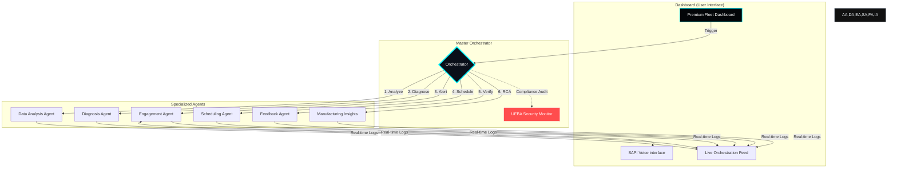

# MECH-CHAT | Agentic Fleet Control Center

MECH-CHAT is a premium, full-stack agentic orchestration system designed for high-performance vehicle fleet management. It leverages a multi-agent architecture to monitor telemetry, diagnose failures, and coordinate maintenance workflows with zero manual intervention.

 *(Placeholder if you have a screenshot)*

## 🏗️ System Architecture & Orchestration

Instead of long manuals, here is how MECH-CHAT orchestrates your fleet:



### 🚀 High-Level Workflow
1. **Detection**: Analysts monitor Heat, Tires, RPM, and Coolant.
2. **Alert**: SAPI interface engages the driver with personalized voice alerts.
3. **Action**: Scheduling agent automatically books specialized service slots.
4. **Insight**: Failures are traced back to specific factory component batches.

---

## 🛠️ Tech Stack

- **Backend**: Python 3.x, Flask, Flask-CORS
- **Frontend**: TypeScript, Vite, Vanilla CSS (Modern CSS3)
- **Architecture**: Multi-Agent System (MAS), RESTful API
- **Data**: Synthetic Telemetry Generator

---

## ⚙️ Installation & Setup

### Prerequisites
- Python 3.8+
- Node.js & npm

### 1. Clone the Repository
```bash
git clone https://github.com/ankushs003/MECH-CHAT.git
cd MECH-CHAT
```

### 2. Setup Backend
```bash
# Install dependencies
pip install flask flask-cors requests

# Generate synthetic vehicle data
python data/generate_data.py

# Start the Mock Server
# Note: Use PYTHONPATH="." to ensure agent imports resolve
$env:PYTHONPATH="."; python api/mock_server.py
```

### 3. Setup Frontend
```bash
cd dashboard
npm install
npm run dev
```
The dashboard will be available at `http://localhost:3000`.

---

## 📂 Project Structure

- `agents/`: Logic for the various specialized agents.
- `api/`: Flask server implementation and API routes.
- `dashboard/`: Vite-based TypeScript frontend.
- `data/`: Synthetic data generation logic and JSON store.
- `security/`: UEBA monitor and audit systems.
- `sapi/`: Bridge for the SAPI voice interface.

---

## 🛡️ Security Audit
Every orchestration task is audited by the **UEBA Monitor**. You can view live system approvals and flags in the "Security Audit" panel on the dashboard.

---

## 📄 License
This project is for demonstration purposes. All rights reserved.
